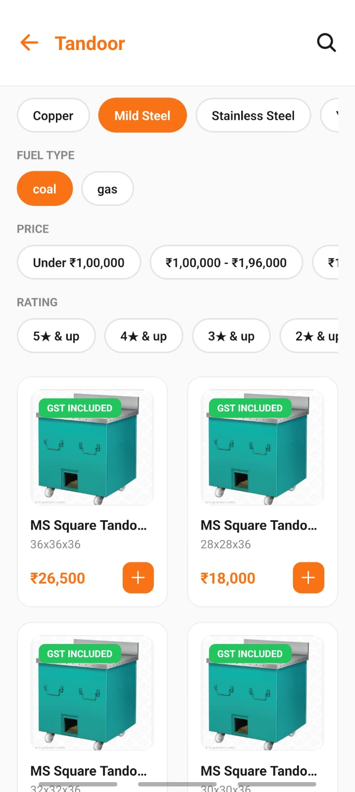
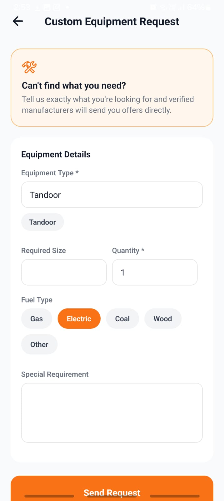
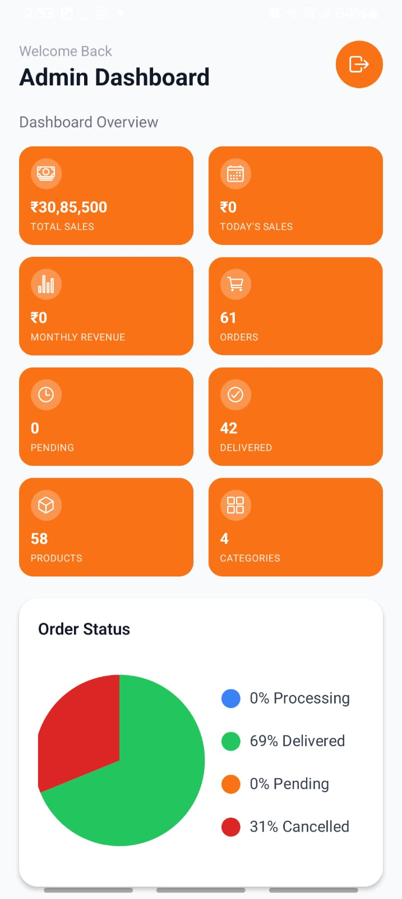

# ProKitchen | B2B Kitchen Equipment Ordering Platform

## 📌 About the Project

ProKitchen is a B2B mobile application developed to simplify the process of purchasing kitchen equipment for hotels, restaurants, and other businesses.

The application provides a digital platform where users can browse kitchen equipment, view product details, add products to their cart, place orders, track orders, and submit custom equipment requirements.

The platform also includes an admin side for managing products, orders, customers, inventory, and custom requests.

> **Note:** This project was developed for a client. The source code, database credentials, API keys, and confidential client information are not publicly available.

---

## 🎯 Problem Statement

Kitchen equipment manufacturers and buyers often manage orders through phone calls and WhatsApp, which can result in:

- Manual order management
- Difficulty tracking inventory
- Scattered customer information
- Limited order status visibility
- Communication gaps
- Delays and manual errors
- Difficulty managing custom equipment requirements

---

## 💡 Proposed Solution

ProKitchen provides a centralized B2B ordering platform that digitizes the purchasing process.

Users can:

- Browse kitchen equipment
- Explore product categories
- Search and filter products
- View product details
- Add products to cart
- Place orders
- Track order status
- View order history
- Submit custom equipment requests
- Receive quotations for custom requirements

The admin side allows administrators to manage products, orders, customers, inventory, and custom requests.

---

## ✨ Features

### 👤 User Features

- User registration and authentication
- Product categories
- Product browsing
- Product search and filtering
- Product details
- Add to cart
- Order placement
- Order history
- Order tracking
- Custom equipment requests
- Quotation-based ordering
- User profile

### 🛠️ Admin Features

- Admin authentication
- Admin dashboard
- Product management
- Order management
- Customer management
- Inventory management
- Custom request management
- Quotation management
- Order status management

---

## 🔄 Custom Request & Quotation Workflow

```text
User submits custom request
            ↓
Admin receives request
            ↓
Admin reviews requirements
            ↓
Admin provides quotation
            ↓
User reviews quotation
            ↓
User proceeds with order
````

---

## 🧰 Technology Stack

| Technology              | Purpose                                          |
| ----------------------- | ------------------------------------------------ |
| React Native            | Mobile application development                   |
| Expo                    | React Native development and application tooling |
| Expo Router             | Application navigation and routing               |
| Supabase                | Backend services                                 |
| PostgreSQL              | Database                                         |
| Supabase Auth           | User authentication                              |
| Supabase Edge Functions | Backend functionality                            |
| PostgreSQL Triggers     | Database-driven workflows                        |

---

## 🏗️ System Architecture

```text
                    ProKitchen
                        │
                        ▼
              React Native Mobile App
                        │
                        ▼
                   Expo Router
                        │
                        ▼
                     Supabase
                ┌───────┼────────┐
                │       │        │
                ▼       ▼        ▼
           Supabase   PostgreSQL  Edge
              Auth     Database   Functions
                         │
                         ▼
                PostgreSQL Triggers
```

---

## 🧪 Testing

The application was tested across different user roles and workflows.

### Role-Based Routing

```text
User Login
    ↓
User Home
```

```text
Admin Login
    ↓
Admin Dashboard
```

### Custom Request Testing

```text
User Request
     ↓
Admin Receives Request
     ↓
Admin Provides Quotation
     ↓
User Reviews Quotation
     ↓
Order Placement
```

---

## 📸 Screenshots

Screenshots are provided for demonstration purposes only.

### 🏠 Home Screen


### 🛍️ Product Listing



### 📝 Custom Request



### 📊 Admin Dashboard



---

## 🔐 Client Confidentiality

As this application was developed for a client, the following are not included in this repository:

* Source code
* Client/customer information
* Database credentials
* API keys
* Environment variables
* Production database information
* Confidential business information

The repository is intended to showcase the project concept, functionality, architecture, technology stack, and development experience without exposing private client information.

---

## 👩‍💻 My Contribution

As part of the development team, my contributions included:

* Database development
* Business logic implementation
* Supabase integration
* Authentication and user flows
* Database-driven application functionality
* Order and custom-request workflows
* Application testing
* Collaboration with the development team

---

## 👥 Team

| Team Member      | Contribution                |
| ---------------- | --------------------------- |
| Harsh Kumar      | Team Leader, Business Logic |
| Goraangi Ratra   | Database, Business Logi,    |
| Kashish Mangla   | Database, UI/UX Design      |
| Himanshu Chawala | Documentation, UI/UX Design |

---

## 📌 Project Status

**Developed as a client project.**

The source code is kept private due to client confidentiality.

---

## 👩‍💻 Developer

**Goraangi Ratra**

BCA Student | Data Analytics | Data Science | Application Development

````
